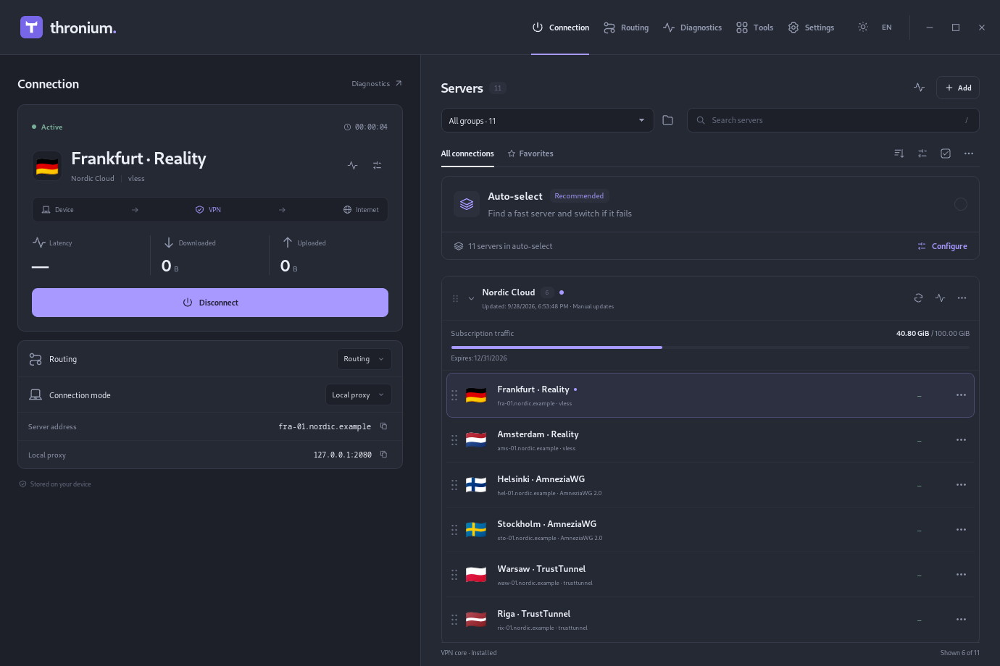

# Thronium

[English](README.md) · **Русский**

**Современный прокси- и VPN-клиент для рабочего стола: быстрый и продуманный
интерфейс на проверенной основе [Throne](https://github.com/throneproj/Throne).**

Thronium работает сразу с [sing-box](https://github.com/SagerNet/sing-box) и
[Xray](https://github.com/XTLS/Xray-core) вместе с форками протоколов, на
которые полагаются пользователи Throne, — AmneziaWG, TrustTunnel, Mieru,
NaïveProxy и другими. Он написан с нуля как приложение
[Tauri 2](https://tauri.app/): интерфейс на React, движок на Rust и ядро на Go.
Поэтому он лёгкий и отзывчивый, а всё, что нужно каждый
день, — выбрать сервер, проверить его, разложить подписки, настроить
маршрутизацию — делается одним кликом, а не правкой конфигов.

Переходите с Throne или Nekoray? Thronium за один шаг импортирует бэкап или
установленную библиотеку: профили, группы, подписки, маршруты и настройки.

> **Версия 0.1.0.** Linux (x86_64) и Windows 10/11 (x86_64 и ARM64).
> macOS в планах.

<p align="center">
  
  
</p>

## Почему Thronium

### Автовыбор сервера, который подстраивается под вас

- **Быстрый автовыбор всегда под рукой.** Одна карточка выбирает лучший сервер
  из всех групп или из одной, переключается при сбое и запоминает последний
  удачный выбор (до 24 часов), чтобы при следующем подключении проверить его
  первым.
- **Пулы настолько гибкие, насколько нужно.** Пул собирается из группы, по
  фильтру или из явного списка: фильтры по имени и стране, исключающие
  шаблоны, порядок по задержке или по сохранённым результатам, предел пула и
  лимит при запуске, балансировка, закреплённый сервер.
- **Самовосстановление.** Проверки здоровья и мгновенное переключение работают
  внутри ядра; пул может измерить серверы перед подключением, стартовать «тёплым»
  по сохранённым результатам и пересобраться сам, когда отказали все серверы
  или обновилась подписка.
- **Прозрачность.** История переключений показывает, какой сервер подхватил
  работу и почему.

### Пинг, который просто работает

- **Метод выбирается сам.** Задержка меряется по HTTP, а если сервер так не
  отвечает — по TCP и затем по ICMP. Thronium знает, какие протоколы нельзя
  пинговать по TCP (WireGuard, Hysteria, TUIC, QUIC-транспорты и другие), и
  учитывает это. Любой метод можно выбрать и вручную.
- **И VPN тоже.** Профили OpenVPN, OpenConnect и других VPN проверяются в
  отдельной временной сессии ядра, не мешая текущему подключению.
- **Не только задержка.** Внешний IP и страна, тест скорости, периодическая
  проверка избранного и журнал всех измерений.

### Подписки в порядке

- Каждая подписка — своя группа со своим интервалом обновления, User-Agent,
  заголовками и переключателем «обновлять через прокси».
- **Правила имён** держат списки в чистоте: отбор и исключение по шаблону,
  переименование серверов при загрузке.
- **Просмотр перед применением.** Обновление сначала показывает, что
  добавится, изменится и удалится, и только потом трогает библиотеку;
  обновления идут по очереди и по расписанию.
- **Данные провайдера.** Название, объявления, квота трафика и срок действия,
  маршрутизация от провайдера (в том числе `happ://routing/`).

### Маршрутизация без JSON

- Визуальный редактор вложенных условий И/ИЛИ, выход для каждого правила и
  действия правил (маршрут, блокировка, напрямую, перехват DNS, определение
  протокола, разрешение домена, обход).
- Профили маршрутизации со своими DNS-серверами и правилами, hosts и FakeIP,
  геоданные и наборы правил, готовые пресеты.

### Два движка и полный контроль

- **sing-box и Xray в одном клиенте.** Профили VLESS работают на выбранном
  движке: общий выбор по умолчанию и переопределение для отдельного профиля,
  при этом сохранённый профиль не переписывается.
- Полные конфигурации sing-box и Xray как профили, цепочки прокси и внешние
  ядра, запускаемые как локальный прокси.
- Настройки каждого ядра: уровни журнала, API, мультиплексирование и
  API-панель.

### AmneziaWG нативно

AmneziaWG **2.0 и 3.0/3.1** работают нативно, как и 1.0 и 1.5: мусорные пакеты,
защита заголовков, дополнение, диапазоны таймингов, трейлеры и cookies. В
списке видно, какую версию использует каждый профиль.

### Импорт чего угодно

- Ссылки и QR-коды в обе стороны для всех поддерживаемых протоколов.
- **Ссылки и подписки Amnezia `vpn://`** — конфигурации AmneziaWG, WireGuard,
  Xray и OpenVPN внутри распознаются автоматически.
- **Ссылки TrustTunnel `tt://`**, включая новый формат deep link.
- Clash YAML, WireGuard `.conf`, OpenVPN, OpenConnect и AnyConnect XML,
  SIP008, наборы профилей `thronium://`, бэкапы и библиотеки Throne.

### Корпоративные VPN с одноразовыми кодами

Интерактивный вход OpenVPN и OpenConnect и встроенный аутентификатор
HOTP/TOTP, коды которого сами подставляются в формы VPN.

### Безопасность по умолчанию

- Вся библиотека запечатана ключом из системной связки ключей (Secret Service
  на Linux, «Диспетчер учётных данных» на Windows).
- Системный прокси восстанавливается даже после сбоя; на Linux упавшее
  ядро перезапускается.
- Окно само не обращается ни к сети, ни к системе: каждое действие — это
  типизированная команда движку.

### Удобство каждый день

Трей со значками состояния, уведомления, переносной режим, бэкапы, поиск
дубликатов с подтверждением перед удалением, поиск по настройкам, статистика
трафика по профилям и приложениям, ссылки `throne://` и `thronium://`,
светлая, тёмная и системная темы, русский и английский.

## Протоколы

SOCKS, HTTP(S), Shadowsocks, Trojan, VMess, VLESS (sing-box и Xray), TUIC,
Hysteria и Hysteria2, AnyTLS, Mieru, Snell, NaïveProxy, Juicity, TrustTunnel,
ShadowTLS, WireGuard, AmneziaWG, SSH, OpenVPN, OpenConnect и Tailscale.

Способы подключения: локальный прокси, системный прокси (GNOME, KDE, Windows)
и TUN (на Linux — через привилегированного помощника, на Windows — через
службу Thronium) с системным DNS.

## Как устроен

```
desktop/src         окно на React и TypeScript
      │  типизированные команды IPC (desktop/contracts)
desktop/src-tauri   хост Tauri 2 на Rust: окно, трей, интеграция с ОС
      │
desktop/engine      движок на Rust: библиотека, профили, маршрутизация,
      │             подписки, системный прокси, TUN, секреты, импорт из Throne
      │  protobuf по закрытому сокету (Unix) или именованному каналу (Windows)
core/server         ThroniumCore на Go: sing-box и Xray с форками протоколов;
                    на Windows ещё и служба для TUN
```

Движок владеет библиотекой и запускает ядро как проверенный дочерний процесс
(для TUN — через помощника или службу).

## Репозиторий

| Путь | Что там |
| --- | --- |
| `desktop/` | Приложение: `src`, `src-tauri`, `engine`, `locales`, `contracts`, `tests`, `scripts` |
| `core/server/` | Ядро на Go |
| `docs/DEVELOPMENT.md` | Проверки, native-стенды, скрипты (на английском) |
| `.github/workflows/` | Проверки качества и сборки Linux и Windows |

## Сборка

Все команды выполняются в `desktop/`. Ядро и приложение собирают скрипты
репозитория; в систему ничего не устанавливается.

### Linux

Проверено на Fedora 44, x86_64. Нужны:

- Node.js 22 с npm, Rust (stable, 1.98 или новее), Go 1.26, Python 3 с `venv`
  и `pip`, Clang и LLVM LLD (ядро компонует Cronet для NaïveProxy);
- [зависимости Tauri для Linux](https://v2.tauri.app/start/prerequisites/#linux):
  пакеты разработки GTK 3 и WebKitGTK 4.1, `glib2`, `pkg-config`.

```sh
cd desktop
npm ci
npm run core:build        # ThroniumCore в src-tauri/binaries
npm run desktop:build     # отладочная сборка
./src-tauri/target/debug/Thronium
```

`npm run tauri dev` запускает окно с живой перезагрузкой, когда ядро уже собрано.

Пакеты для выпуска (deb, rpm и AppImage в
`src-tauri/target/release/bundle/`):

```sh
npm run release:linux
```

Для AppImage загружается `linuxdeploy`; встроенный в него `strip` не читает
бинарные файлы современных компиляторов, поэтому скрипт упаковывает их без
обрезки (`NO_STRIP=true`) и запускает `linuxdeploy` без FUSE.

### Windows

Установщик — NSIS: ставит программу для всех пользователей (вместе со службой
TUN) или только для текущего и при необходимости устанавливает WebView2.

**С Linux** (Fedora или другая система с `dnf`; наборы MinGW, llvm-mingw и NSIS
загружаются в `desktop/.tools` при первом запуске):

```sh
rustup target add x86_64-pc-windows-gnu aarch64-pc-windows-gnullvm
npm run release:windows                    # x86_64
npm run release:windows -- --arch aarch64  # ARM64
```

**На Windows**: один раз запустите `desktop/scripts/windows_bootstrap.ps1` в
PowerShell от администратора (он ставит MSVC, Go, Node, Python и Git), затем
`npm ci` и `npm run release:windows`.

Установщик и бинарные файлы появятся в
`desktop/test-results/windows/<время>/build/`.

**Подпись.** Сборка не подписывается, пока окружение не называет, чем
подписывать: `THRONIUM_SIGN_COMMAND` (команда с `%1` вместо файла, например
`trusted-signing-cli` для Azure Trusted Signing) или `THRONIUM_SIGN_THUMBPRINT`
(сертификат в хранилище пользователя). Подробнее —
`desktop/scripts/windows_signing.py`.

## Проверки

```sh
npm run check:frontend    # типы, линтер, формат, каталоги, модульные тесты
npm run contracts:check   # контракты IPC совпадают с движком
npm run test:engine       # модульные и интеграционные тесты движка
npm run test:engine-live  # тесты движка с настоящим ядром
npm run native -- --list  # native-стенды окна на приватном дисплее
```

Подробности, в том числе о проверках для Windows, — в
[docs/DEVELOPMENT.md](docs/DEVELOPMENT.md).

## Лицензия

GPL-3.0, как у Throne. См. [LICENSE](LICENSE). Шрифт Manrope распространяется
по лицензии SIL Open Font License
([desktop/src/assets/OFL-Manrope.txt](desktop/src/assets/OFL-Manrope.txt)).

## Благодарности

- [Throne](https://github.com/throneproj/Throne) и
  [Nekoray](https://github.com/MatsuriDayo/nekoray) — их форки протоколов и
  годы работы лежат в основе Thronium
- [SagerNet/sing-box](https://github.com/SagerNet/sing-box) и
  [XTLS/Xray-core](https://github.com/xtls/xray-core)
- [Tauri](https://tauri.app/)
